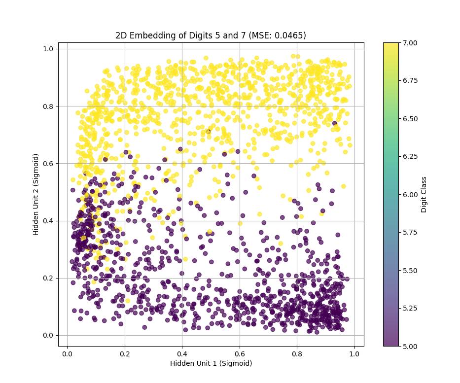
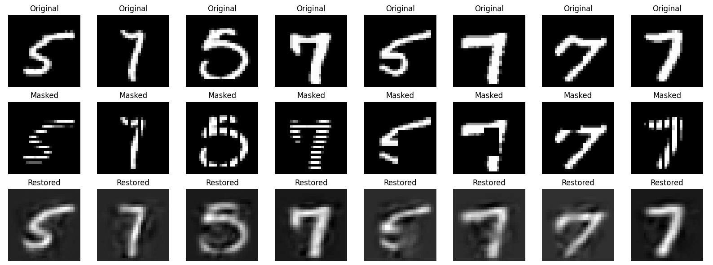

# Autoencoder for MNIST Digit Recognition

An unsupervised learning implementation using shallow autoencoders for dimensionality reduction and image restoration on the MNIST dataset.

## 📋 Overview

This project demonstrates two fundamental applications of autoencoders:
1. **Dimensionality Reduction (Image Embedding)**: Compressing 784-dimensional images into a 2D latent space
2. **Image Restoration (Denoising)**: Reconstructing masked/corrupted images through associative memory

Autoencoders are neural networks designed to learn efficient data representations in an unsupervised manner. The network consists of an encoder that compresses input data into a lower-dimensional latent space and a decoder that reconstructs the original input from this compressed representation.

## 🏗️ Architecture

### Network Structure
```
Input Layer (784 neurons) → Hidden Layer (h neurons, Sigmoid) → Output Layer (784 neurons, Linear)
```

**Components:**
- **Encoder**: Compresses 28×28 pixel images (784 dimensions) into h-dimensional latent representations
- **Decoder**: Reconstructs the original image from the latent representation
- **Activation Functions**: Sigmoid for hidden layer, Linear for output layer

### Two Experimental Configurations

#### 1. Image Embedding (h=2)
- **Purpose**: Visualize learned representations
- **Latent Space**: 2 dimensions for easy visualization
- **Output**: 2D scatter plot showing digit separation

#### 2. Image Restoration (h=64)
- **Purpose**: Restore masked/corrupted images
- **Latent Space**: 64 dimensions for richer representations
- **Output**: Reconstructed images with missing regions filled

## 🎯 Dataset

**MNIST Handwritten Digits**
- **Source**: [Yann LeCun's MNIST Database](http://yann.lecun.com/exdb/mnist/)
- **Subset Used**: Digits 5 and 7 only (for simplified visualization)
- **Training Samples**: ~11,000 images
- **Test Samples**: ~1,800 images
- **Image Dimensions**: 28×28 pixels (grayscale)
- **Preprocessing**: Normalized to [0, 1] by dividing by 255

## 🔬 Experiments and Results

### Experiment 1: Dimensionality Reduction (h=2)

**Objective**: Learn a 2D representation that separates digits 5 and 7.

**Results:**
- **Reconstruction MSE**: 0.04653
- **Visual Separation**: Clear clustering of digits in 2D latent space
- **Key Finding**: Without using any labels, the autoencoder learned to separate the two digit classes into distinct regions

**Interpretation:**
The network discovered that encoding images into just 2 dimensions is sufficient to capture the essential differences between digits 5 and 7. This demonstrates the autoencoder's ability to perform unsupervised feature learning.


*Figure: 2D latent space showing clear separation between digits 5 (blue) and 7 (orange)*

---

### Experiment 2: Image Restoration (h=64)

**Objective**: Restore images with masked regions (simulate corrupted or incomplete data).

**Methodology:**
1. Randomly mask portions of test images
2. Feed masked images through the encoder
3. Decoder reconstructs the complete image
4. Compare reconstructed image to original

**Results:**
- **Success Cases**: Effective restoration when masks cover <25% of discriminative features
- **Failure Cases**: Poor reconstruction when critical topological features are occluded
- **Key Finding**: The network "hallucinates" plausible pixel values based on learned digit structure

**Observations:**
- Small masks (5-15% coverage): Excellent restoration
- Medium masks (15-25% coverage): Good restoration with minor artifacts
- Large masks (>25% coverage): Degraded quality, especially when masking loops or endpoints


*Figure: Top row shows original images, middle row shows masked inputs, bottom row shows restored outputs*

---

## 🛠️ Implementation Details

### Technology Stack
- **Framework**: TensorFlow 2.x / Keras
- **Language**: Python 3.8+
- **Key Libraries**: NumPy, Matplotlib, Scikit-learn

### Training Configuration

#### Hyperparameters
```python
epochs = 50
batch_size = 128
optimizer = Adam(learning_rate=0.001)
loss_function = MSE (Mean Squared Error)
```

#### Network Initialization
- **Weights**: Xavier/Glorot uniform initialization
- **Bias**: Zero initialization

### Data Pipeline
1. Load MNIST dataset
2. Filter for digits 5 and 7
3. Flatten images: 28×28 → 784
4. Normalize pixel values to [0, 1]
5. Split into training (80%) and testing (20%)

---

## 📊 Performance Metrics

| Configuration | Latent Dimensions | Reconstruction MSE | Training Time |
|--------------|-------------------|-------------------|---------------|
| Embedding | h=2 | 0.04653 | ~2 minutes |
| Restoration | h=64 | 0.01203 | ~5 minutes |

---

## 🚀 Usage

### Prerequisites
```bash
pip install tensorflow numpy matplotlib scikit-learn
```

### Running the Embedding Experiment
```python
python autoencoder_embedding.py
```
This will:
- Train the autoencoder with h=2
- Generate a 2D scatter plot of the latent space
- Save the visualization as `latent_space.png`

### Running the Restoration Experiment
```python
python autoencoder_restoration.py
```
This will:
- Train the autoencoder with h=64
- Apply random masks to test images
- Generate and save restoration comparisons as `restoration.png`

---

## 🔍 Key Insights

### What Makes This Work?

1. **Bottleneck Architecture**: The narrow hidden layer forces the network to learn compressed representations
2. **Reconstruction Objective**: By training to reproduce inputs, the network learns meaningful features
3. **Unsupervised Learning**: No labels required—the data itself provides the supervision signal

### Limitations

1. **Linear Interpolation**: The latent space may not be perfectly smooth
2. **Dataset-Specific**: Model trained on MNIST may not generalize to other image types
3. **Mask Sensitivity**: Large occlusions (>25%) lead to unreliable reconstructions

### Possible Extensions

- **Variational Autoencoder (VAE)**: Add probabilistic sampling for smoother latent space
- **Denoising Autoencoder**: Train specifically on noisy data
- **Convolutional Autoencoder**: Use CNN layers for better spatial feature learning
- **All Digits**: Extend to full MNIST (0-9) and visualize with t-SNE

---
