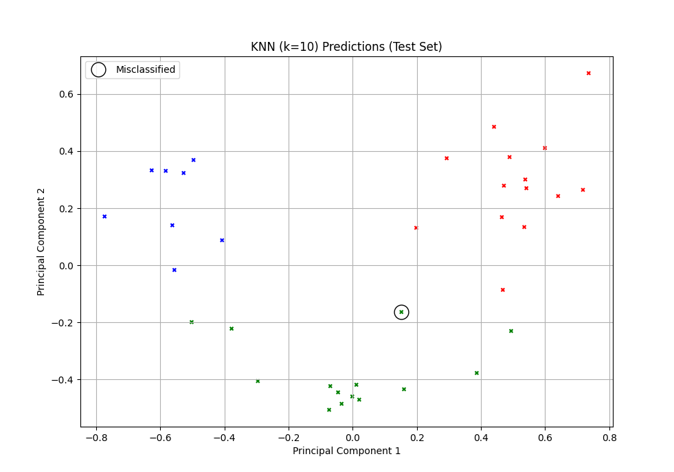

# KNN Classifier - Wine Classification

K-Nearest Neighbors applied to classify wine varieties based on chemical analysis, demonstrating the importance of feature normalization and dataset size effects on k selection.

## 📋 Overview

This experiment applies KNN to classify wines from three different Italian cultivars based on 13 chemical properties. Focus on understanding how dataset size and feature scaling affect optimal k selection.

---

## 🎯 Dataset: Wine Recognition

**Description**: Chemical analysis of wines from three cultivars in Italy.

**Statistics**:
- **Total Samples**: 178
- **Features**: 13 chemical measurements
- **Classes**: 3 wine varieties
- **Train/Test Split**: 70/30 stratified
- **Class Distribution**: 
  - Cultivar 1: 59 samples (33%)
  - Cultivar 2: 71 samples (40%)
  - Cultivar 3: 48 samples (27%)

### Chemical Features (13)

Alcohol, Malic Acid, Ash, Alcalinity of Ash, Magnesium, Total Phenols, Flavanoids, Nonflavanoid Phenols, Proanthocyanins, Color Intensity, Hue, OD280/OD315, Proline

**Key Issue**: Features have vastly different scales
- **Proline**: 278-1680 (magnitude ~1000)
- **Hue**: 0.48-1.71 (magnitude ~1)

---

## 🔧 Preprocessing

### Feature Normalization: Critical for Distance-Based Methods

**Min-Max Normalization to [0, 1]**:
```
X_scaled = (X - X_min) / (X_max - X_min)
```

**Why Essential**: Without normalization, Proline would completely dominate distance calculations.

---

## 🔬 Experiment: Small Dataset Behavior

### Objective
Compare moderate (k=10) vs large (k=30) values to understand k selection for small datasets.

**Why These k Values?**
- **k=10**: Moderate smoothing (~8% of training data)
- **k=30**: Heavy smoothing (~24% of training data)

---

## 📊 Results

### Performance Comparison

| k | Accuracy | Analysis |
|---|----------|----------|
| **10** | **0.9722** | **Optimal for this dataset** |
| 30 | 0.9444 | Over-smoothing, includes noise from other classes |

**Winner**: k=10 achieves **97.22% accuracy**

### Confusion Matrices

**k=10 Performance** (Near Perfect):
```
Predicted:    C1  C2  C3
Actual: C1   [18   0   0]
        C2   [ 0  20   1]
        C3   [ 0   0  15]
```

**k=30 Performance** (More Errors):
```
Predicted:    C1  C2  C3
Actual: C1   [17   1   0]
        C2   [ 0  19   2]
        C3   [ 0   0  15]
```

---

## 🔍 Analysis

### Why k=10 Outperforms k=30

**Dataset Size Effect**:
- Total training samples: ~125
- k=30 uses 24% of all training data per prediction
- Risk: Including samples from other classes in the neighborhood

**Decision Boundary Over-smoothing**:
- Large k averages over too many neighbors
- Blurs distinctions between well-separated classes

### PCA Visualization Insight

  
*Three wine varieties show clear separation in 2D principal component space*

**Key Observation**: Classes are naturally well-separated → Small k is sufficient to capture local structure.

---

## 🚀 Key Findings

### Takeaways

1. **Normalization is Essential**: Without scaling, high-magnitude features dominate
2. **Dataset Size Matters**: With only 178 samples, k=30 is too large
3. **Class Separability**: PCA shows natural clustering; KNN exploits this well
4. **Simple Works**: No feature engineering needed

### Rule of Thumb for k Selection

- **Small datasets (n < 500)**: Try k = √n, experiment with k ∈ [5, 15]
- **Avoid k > n/5**: Using >20% of data causes over-smoothing

---