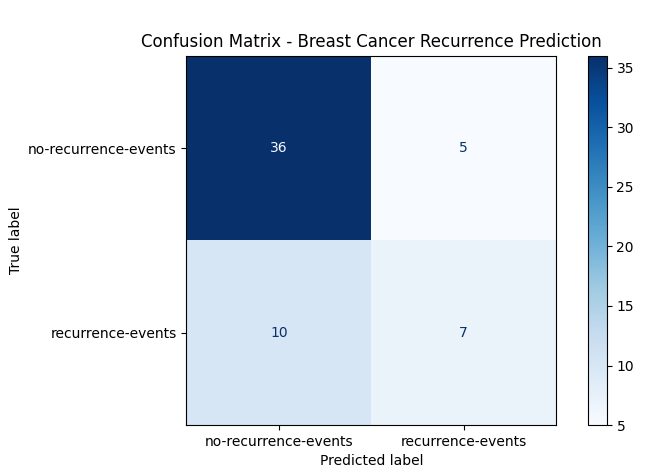

# Naive Bayes Classifier - Breast Cancer Recurrence Prediction

Categorical Naive Bayes for predicting breast cancer recurrence from patient medical records.

## 📋 Overview

Predicts whether breast cancer will recur after treatment using patient medical records. Demonstrates challenges with class imbalanced data and medical prediction.

**Source**: University Medical Centre, Institute of Oncology, Ljubljana, Yugoslavia

---

## 🎯 Dataset: Breast Cancer

**Statistics**:
- **Total Samples**: 286 patients
- **Features**: 9 categorical (age, tumor-size, inv-nodes, menopause, etc.)
- **Classes**: 2 (recurrence-events, no-recurrence-events)
- **Missing Values**: 8 instances contain '?'
- **Train/Test Split**: 80/20 stratified

### Class Distribution (Imbalanced)

| Class | Percentage |
|-------|------------|
| **no-recurrence-events** | ~70% (Majority) |
| **recurrence-events** | ~30% (Minority) |

---

## 🔧 Preprocessing

**1. Missing Values**: Treat '?' as separate category ('unknown')

**2. Ordinal Encoding**: For features with natural order (age ranges, tumor sizes)
```
Example: age ranges
10-19 → 0, 20-29 → 1, 30-39 → 2, etc.
```

**3. Stratified Split**: Maintains 70/30 class ratio in train and test sets

---

## 📊 Results

### Overall Performance

| Metric | Value |
|--------|-------|
| **Accuracy** | **74%** |
| **Correct Predictions** | 50 / 68 test samples |

### Per-Class Performance

| Class | Precision | Recall | F1-Score |
|-------|-----------|--------|----------|
| **no-recurrence-events** | 0.78 | 0.88 | 0.83 |
| **recurrence-events** | 0.56 | 0.41 | 0.47 |

### Confusion Matrix

```
Predicted:            No-Recurrence   Recurrence
Actual: No-Recurrence      [45            6]
        Recurrence         [10            7]
```



**Critical Issue**: **10 false negatives** → Missed 59% of actual recurrence cases

---

## 🔍 Analysis

### The Class Imbalance Problem

**Model Bias**: Strong bias toward majority class (no-recurrence)

**Evidence**:
- High recall for no-recurrence (88%): Good at identifying non-recurrence
- **Low recall for recurrence (41%)**: Misses majority of recurrence cases
- This is **dangerous in medical contexts** where false negatives can be life-threatening

### Clinical Implications

**False Negative Rate: 59%**
- Patients told "low risk" when recurrence will actually occur
- May delay preventive treatments or monitoring
- **In medicine, missing a disease is often worse than a false alarm**

---

## 🚀 Key Findings

### Strengths
✅ Handles categorical medical data naturally  
✅ Fast training and prediction  
✅ Provides probabilistic confidence scores  

### Limitations
❌ **Independence assumption**: Medical features are often correlated (e.g., tumor size + lymph nodes)  
❌ **Class imbalance**: Biases toward majority class without correction  
❌ **Low recall for minority class**: Dangerous in medical applications  

---

## 💡 Possible Improvements

1. **Address Imbalance**: SMOTE oversampling or class weighting
2. **Feature Engineering**: Create interaction features (age × tumor-size)
3. **Alternative Models**: Random Forest or XGBoost handle imbalance better
4. **Threshold Tuning**: Lower decision threshold to increase recall

---