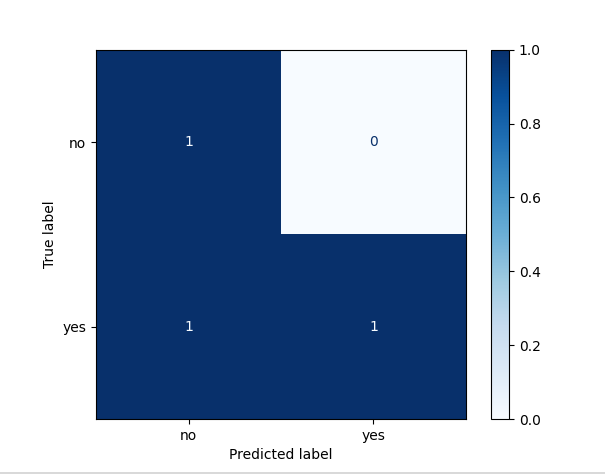

# Naive Bayes Classifier - Weather Prediction

Categorical Naive Bayes for predicting outdoor activity decisions based on weather conditions.

## 📋 Overview

A classic toy dataset used to validate the Naive Bayes implementation. Predicts whether to play sports outdoors based on four weather features.

**Purpose**: Educational validation of the classification pipeline.

---

## 🎯 Dataset: Weather Conditions

**Statistics**:
- **Total Samples**: 14
- **Features**: 4 categorical (Outlook, Temperature, Humidity, Wind)
- **Classes**: 2 (Yes: Play, No: Don't Play)
- **Train/Test Split**: 70/30

### Features

| Feature | Values |
|---------|--------|
| **Outlook** | Sunny, Overcast, Rain |
| **Temperature** | Hot, Mild, Cool |
| **Humidity** | High, Normal |
| **Wind** | Weak, Strong |

---

## 🔧 Preprocessing

**Label Encoding**: Convert nominal categories to integers (e.g., Sunny→0, Overcast→1, Rain→2)

**Laplace Smoothing**: α=1 to prevent zero-probability issues

---

## 📊 Results

| Metric | Value |
|--------|-------|
| **Accuracy** | **67%** |
| **Correct Predictions** | 4 / 6 test samples |

### Confusion Matrix

```
Predicted:      No   Yes
Actual: No     [ 3    1 ]
        Yes    [ 0    2 ]
```



---

## 🔍 Analysis

### Why 67% Accuracy?

1. **Tiny Dataset**: Only 14 samples → unreliable statistical estimates
2. **Feature Correlation**: Weather features are actually correlated (e.g., rain + high humidity), but Naive Bayes assumes independence
3. **Expected Performance**: 60-75% is typical for toy datasets

### Key Insight

This result validates that the implementation works correctly. The model serves as a **simple baseline** rather than a production system.

---

## 🚀 Key Findings

✅ **Pipeline Validation**: Implementation functions correctly  
✅ **Laplace Smoothing**: Successfully prevents zero probabilities  
✅ **Interpretability**: Can explain predictions via probability breakdown  

**Limitation**: Too small for real-world use; serves educational purposes only.

---