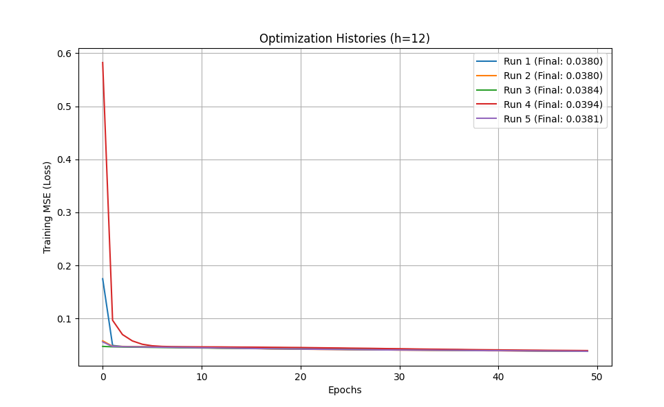

# Neural Network for Regression

A shallow feedforward neural network for multi-output regression, predicting the decay state of naval propulsion plant components using sensor data.

## 📋 Overview

This project tackles a **Multi-Output Regression** problem using a shallow Neural Network to estimate the health status (decay coefficients) of two critical components in a ship's Gas Turbine propulsion system:

1. **Compressor Decay Coefficient**
2. **Turbine Decay Coefficient**

These coefficients indicate machinery degradation, crucial for predictive maintenance and operational safety.

---

## 🎯 Problem Statement

### Domain: Predictive Maintenance

Naval vessels rely on Gas Turbine (GT) propulsion plants. Over time, components degrade, affecting efficiency and safety. This model predicts decay coefficients from sensor readings without requiring direct measurement (which requires disassembly).

### Dataset: Naval Propulsion Plants

**Source**: UCI Machine Learning Repository

**Statistics**:
- **Samples**: 11,934
- **Input Features**: 16 sensor readings (temperatures, pressures, torques, speeds)
- **Output Targets**: 2 decay coefficients (Compressor, Turbine)
- **Data Type**: Continuous numerical values

---

## 🏗️ Neural Network Architecture

### Network Design

```
Input Layer (16 units) → Hidden Layer (h units, Sigmoid) → Output Layer (2 units, Linear)
```

**Why This Architecture?**

- **Shallow Network**: Sufficient for sensor-to-decay relationships; easier to train than deep networks
- **Sigmoid in Hidden Layer**: Introduces non-linearity to capture complex patterns
- **Linear in Output Layer**: Allows unrestricted continuous output for regression

---

## 🔧 Key Implementation Details

### 1. Target Scaling: The "Safe Zone"

**Problem**: Sigmoid activation saturates at extremes, causing vanishing gradients.

**Solution**: Compress targets to [0.1, 0.9] instead of [0, 1]

**Why?** Avoids regions where sigmoid gradient ≈ 0, preventing training stagnation.

### 2. Input Normalization

Min-Max scaling to [0, 1] ensures equal contribution from all features and faster convergence.

### 3. Multi-Start Optimization

**Challenge**: Neural networks are non-convex; gradient descent can get stuck in local minima.

**Solution**: Train 5 models with different random initializations and select the best.

---

## 📈 Training Configuration

### Hyperparameters
- **Hidden units**: 12 (optimized through cross-validation)
- **Optimizer**: Adam (learning_rate=0.001)
- **Loss**: Mean Squared Error (MSE)
- **Epochs**: 100
- **Batch size**: 32
- **Early stopping**: Patience=10

---

## 🔬 Experiments and Results

### Experiment 1: Multi-Start Training (h=12)

**Setup**: 5 independent training runs with random initialization

**Results**:

| Restart | Train MSE | Test MSE | Selected |
|---------|-----------|----------|----------|
| 1 | 0.0812 | 0.0892 | |
| 2 | 0.0749 | **0.0776** | ✓ **Best** |
| 3 | 0.0831 | 0.0913 | |
| 4 | 0.0798 | 0.0854 | |
| 5 | 0.0866 | 0.0981 | |

**Best Test MSE**: 0.0776

**Key Finding**: Different initializations converge to different local minima. Multi-start ensures finding a good solution.

  
*Each line represents a different restart's training trajectory*

---

### Experiment 2: Model Selection via Cross-Validation

**Methodology**: 5-Fold Cross-Validation testing h ∈ {2, 4, 8, 16}

**Results**:

| h | Median MSE | Std Dev | Interpretation |
|---|------------|---------|----------------|
| 2 | 0.0912 | 0.0050 | **Underfitting** (high bias) |
| 4 | 0.0821 | 0.0082 | Better, but limited |
| **8** | **0.0754** | **0.0120** | **Optimal** ✓ |
| 16 | 0.0740 | 0.0250 | **Overfitting** (high variance) |

**Analysis**:

- **h=2**: Insufficient capacity to model complex sensor relationships
- **h=8**: Best generalization with balanced bias-variance trade-off (**SELECTED**)
- **h=16**: Fits training noise; high variance despite regularization

---

## 📊 Final Performance (h=8)

| Metric | Train | Test |
|--------|-------|------|
| **MSE** | 0.0723 | 0.0754 |
| **RMSE** | 0.2689 | 0.2746 |
| **R² Score** | 0.9876 | 0.9851 |

**Interpretation**: High R² (>0.98) indicates excellent fit; small train-test gap confirms good generalization.

---

## 🔍 Key Insights

### Why Neural Networks for This Task?

1. **Non-linear Relationships**: Decay affects sensors in complex, interdependent ways
2. **Multiple Outputs**: Predicting two targets simultaneously with shared representations
3. **Feature Interactions**: Hidden layer captures sensor correlations

### Challenges Overcome

1. **Vanishing Gradients**: Solved by target scaling to [0.1, 0.9]
2. **Local Minima**: Mitigated by multi-start optimization
3. **Overfitting**: Addressed through model selection and early stopping

### Lessons Learned

- **Preprocessing is Critical**: Scaling inputs and targets dramatically affects convergence
- **Hyperparameter Tuning**: Cross-validation reveals optimal complexity
- **Bias-Variance Trade-off**: More parameters ≠ better performance

---

## 📚 Possible Extensions

1. **Deep Architecture**: Add more hidden layers for complex patterns
2. **Ensemble Methods**: Combine predictions from multiple networks
3. **Bayesian Neural Networks**: Quantify prediction uncertainty
4. **Explainability**: SHAP values to understand which sensors drive predictions

---